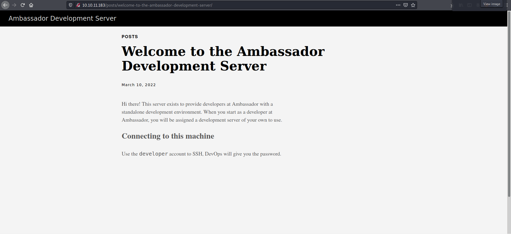
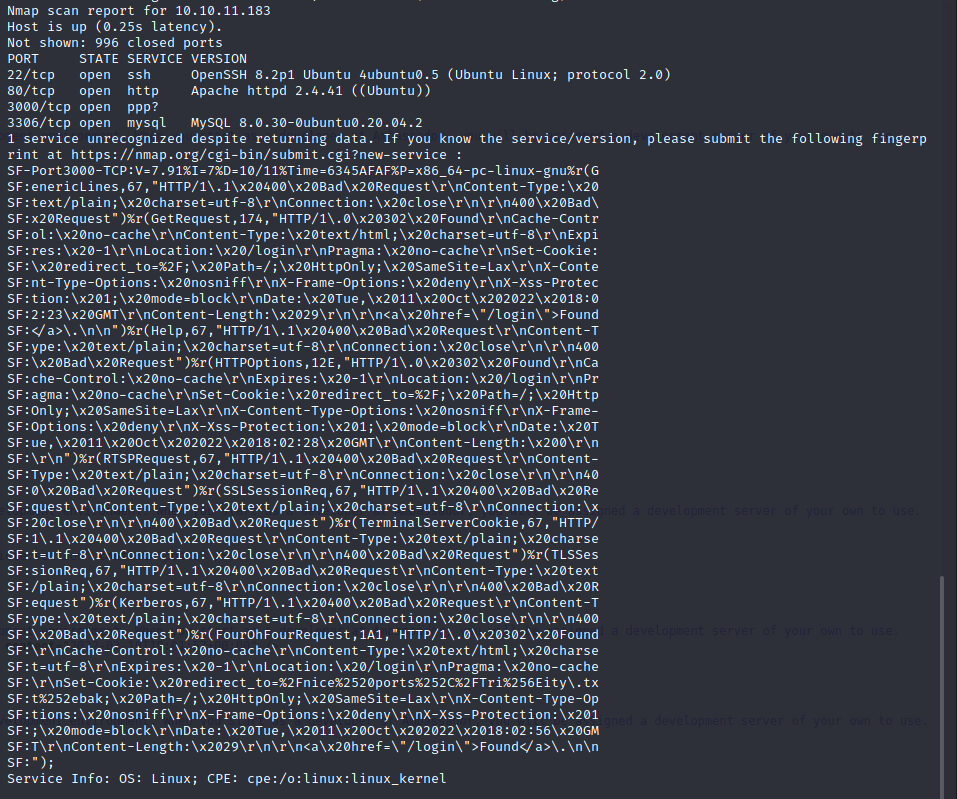
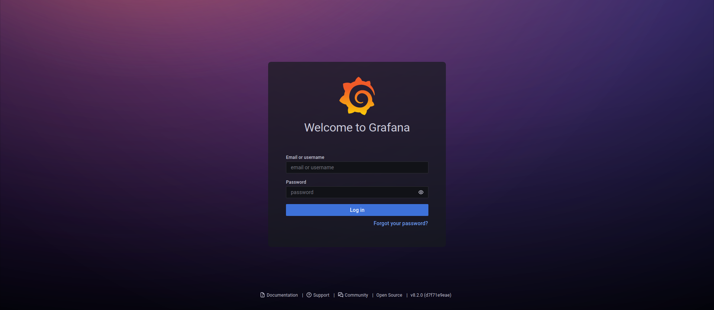
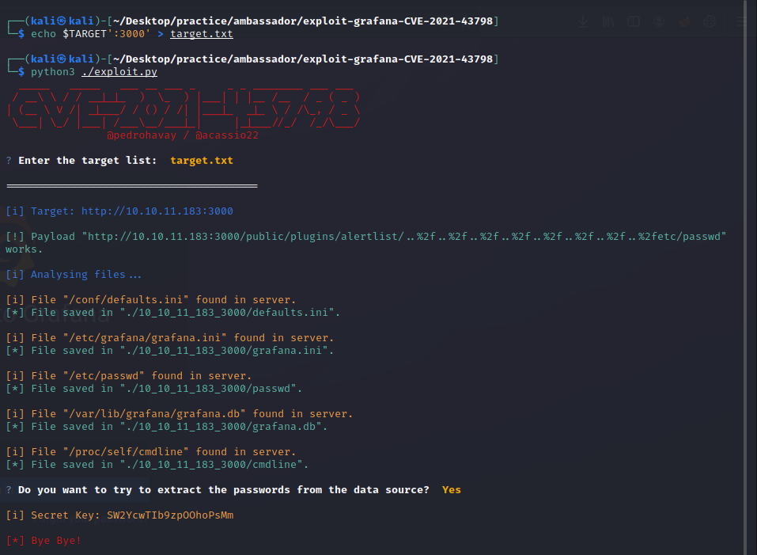
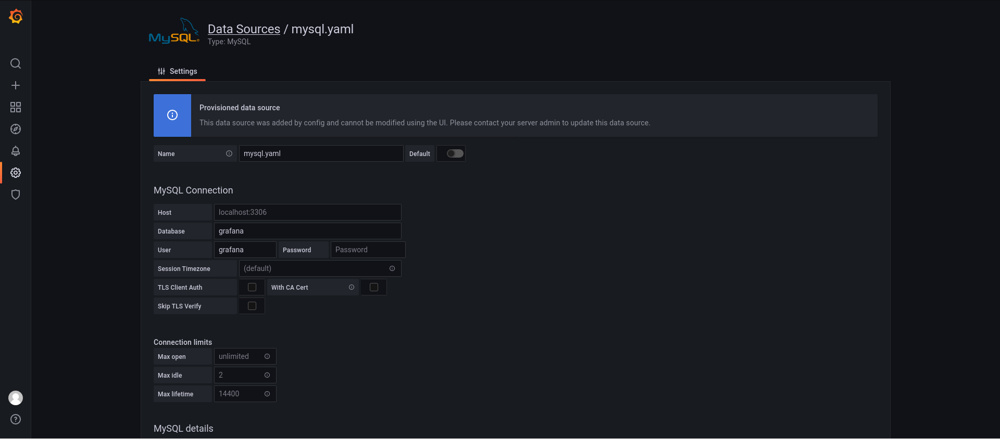
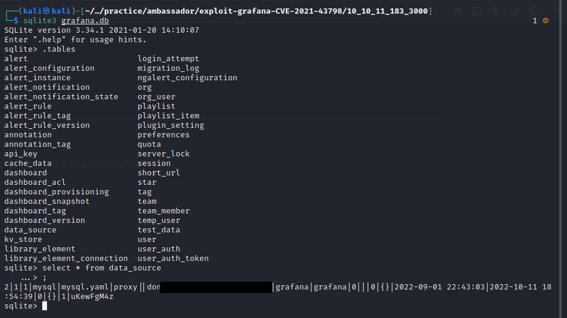
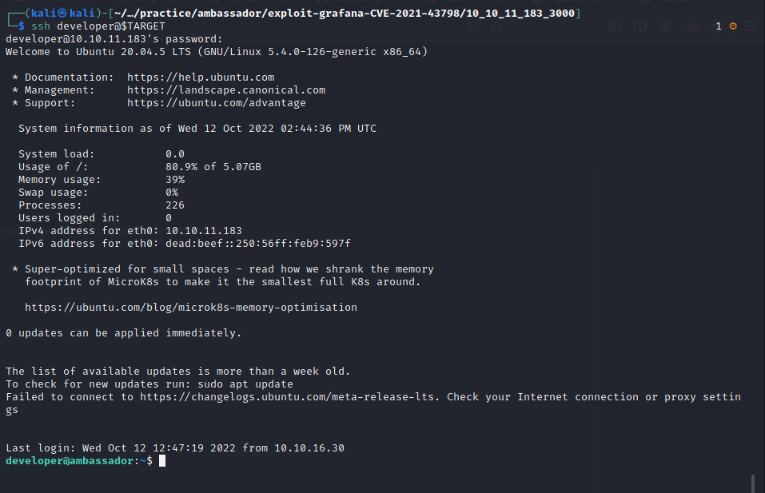

Now that we are connected to Ambassador, the first step is to scan the machine. We will do this using a simple `nmap` version scan and we will save the output for later.

```bash
sudo nmap -sV $TARGET -oN nmap
```

While it's scanning the machine, we could check for http services. And indeed we found the website:



Right from the start we find out an username we can use to SSH into our target. Further on, we are going to examine the source page of the website. Nothing of interest there. The nmap scan confirms SSH is active, along with two other services:



Our target also provides a MySQL database and one more service that `nmap` could not recognize, which seems to work based on http. Examining the webpages and their sources, we find nothing of interest. At this point I've decided to come back to the strange service running on port 3000. It can be accessed through the browser.



We are presented with a login page for Grafana, a tool that "transforms any of your data into flexible and versatile dashboards". We can already assume that it collects data from the sql database we've seen in the scan output. One thing captures my attention and that is the version information at the bottom of the page.

After a bit of online searching, I found that this version (8.2) is vulnerable to directory traversal and arbitrary file read, as in [CVE-2021-43798](https://cve.mitre.org/cgi-bin/cvename.cgi?name=CVE-2021-43798). I was also lucky to find an exploit that retrieves useful information using this vulnerability: https://github.com/pedrohavay/exploit-grafana-CVE-2021-43798

I downloaded the code, now it's time for exploitation. NOTE: The exploit takes a file as input. The full address (IP + Port) must be specified.



This specific exploit reads and extracts configuration files (`defaults.ini`, `grafana.ini`), the `/etc/passwd` file, as long with the `grafana.db` database, while also giving us a secret key, which seems to be the default one.

Inside `grafana.ini` we can find the admin password to access the dashboard.



As expected, Grafana takes data from the SQL database on port 3306. I couldn't find any interesting information other than this on the browser, so I decided to inspect the `grafana.db` found by the exploit.



User information inside `data_source` provides a password for "grafana" user we can use to acces the full database on port 3306.

```bash
mysql -h $TARGET -u grafana -p
```

There is one interesting database named "wackywidget", that holds the "users" table and the password for `developer` user we had seen at the beggining, base64 encrypted. I assumed it is the SSH password so I tried to login after decrypting it.



And we got a shell! We can now submit the user flag located at `/home/developer`