## Reconnaissance

I will be starting by running `nmap` for open ports

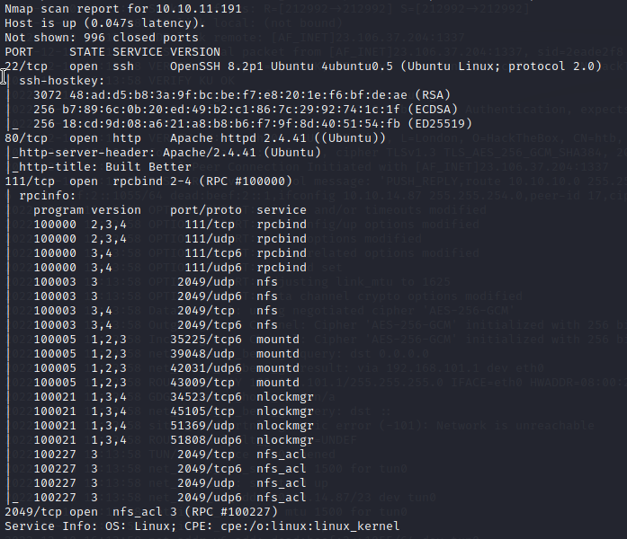

Two common ports are opened for http and ssh. Additionally, this machine serves rpcbind and nfs. As usual, I started by taking a look at the website and enumerating directories using `gobuster`

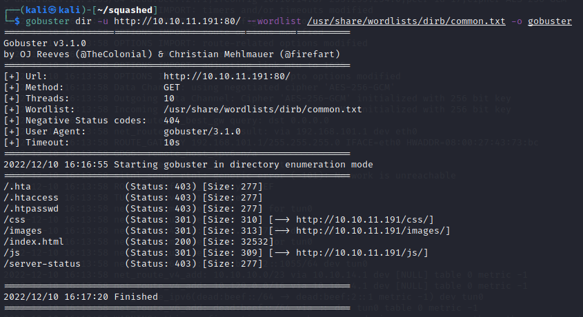

The website does not have any functionality and it serves mostly as a placeholder. I checked the page source code, directories, css and js files and could not find anything of interest. Also, the Apache version does not have any known vulnerabilities, so I decided to gather information from the other services, in particular `nfs`, which stands for network file sharing protocol and it works similar to Samba.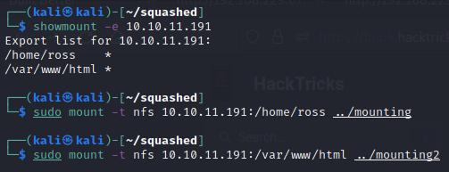

I have mounted the two directories I have found.

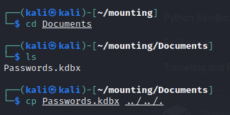

I could find the `.kdbx` file in `/home/ross`, which seems very important, as it used with Keepass, a secure password storage solution. Apart from finding the username "ross", there was nothing else of interest.

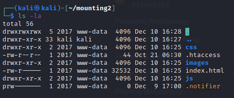

`/var/www/html` contains the website files, as I would expect

## Gaining access

After searching online for a way in, I found a technique that could work and involves exploiting nfs: https://book.hacktricks.xyz/network-services-pentesting/nfs-service-pentesting

I could create a local user with the same UID as the user who owns those directories (2017), thus escalating privileges and obtaining write permission. To test if it would have an effect on the website I've seen, I changed the heading.

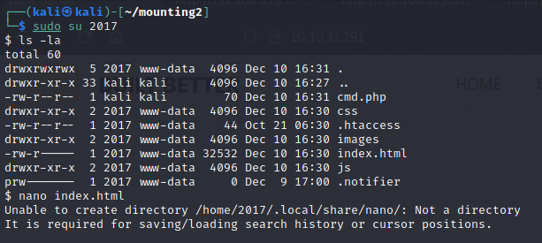

|     |     |
| --- | --- |
| Before | After |
| 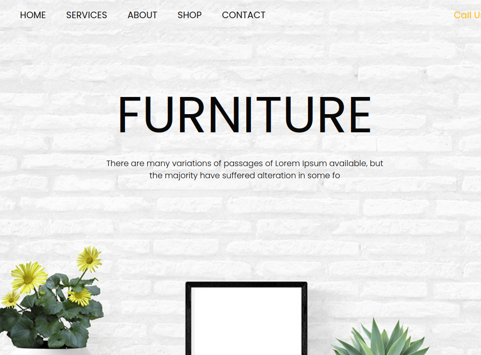 | 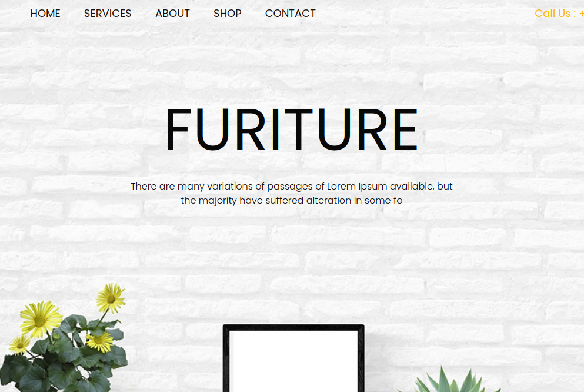 |

By this point, I could see how this can be exploited to gain access. I took a php reverse shell that I uploaded in the website shared directory, executed it and caught the shell with `netcat`.

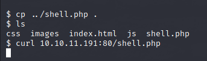  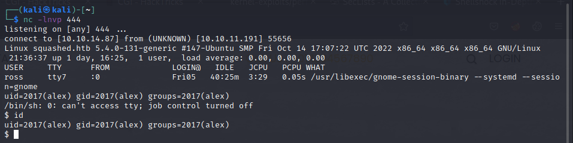

Next, I searched in /home and found a flag.

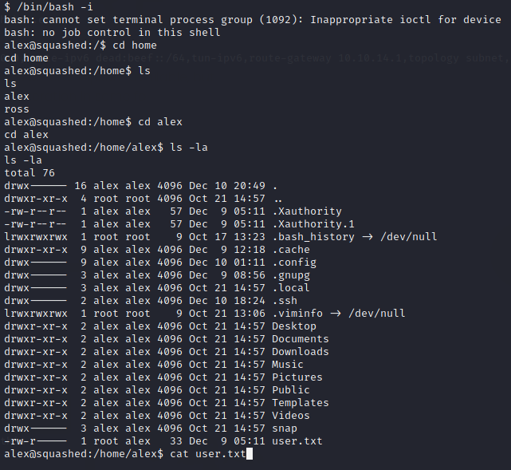

## Privilege escalation

Using the same resource, I have found that nfs can be vulnerable to an attack exploiting `no_root_squash` misconfiguration: [https://book.hacktricks.xyz/linux-hardening/privilege-escalation/nfs-no\_root\_squash-misconfiguration-pe](https://book.hacktricks.xyz/linux-hardening/privilege-escalation/nfs-no_root_squash-misconfiguration-pe)

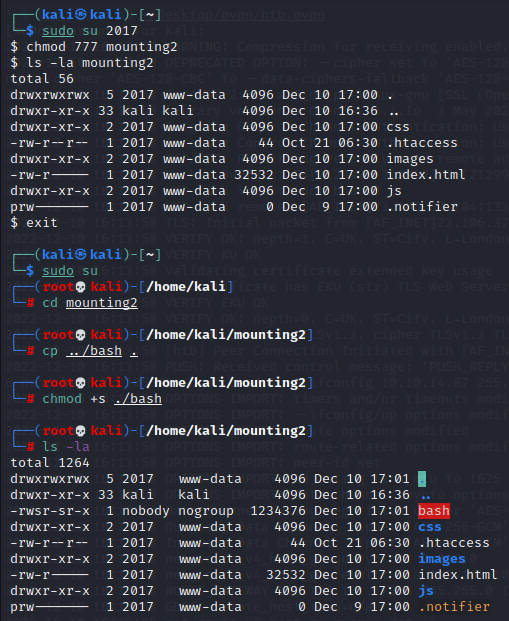

The idea here is simple. I upload my own version of `bash` in the shared directory and give it SUID rights as root. If the directory is vulnerable, this would get me a shell on the victim machine without dropping super user privileges, as the UID would match root's on the victim machine. However it did not work and I were nobody, having a different UID

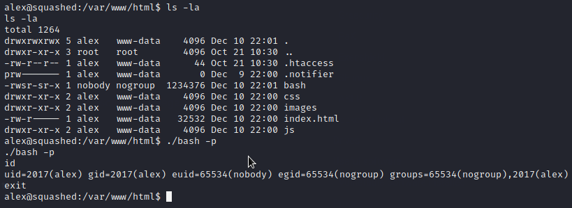

NOTE: As I am writing this, I realize that I could have also checked the `/etc/exports` directory for this misconfiguration

After this, I tried to exploit the `no_all_squash` misconfiguration, still ignoring `/etc/exports`, a mistake by my part. The idea is the same as with `no_root_squash`, but I used ross' UID (1001) instead of root's.

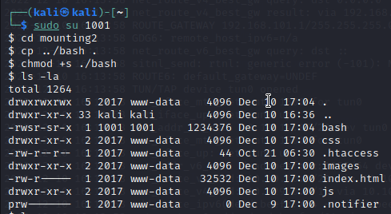 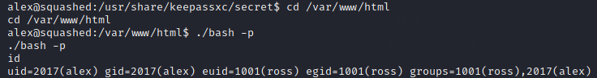

This time it worked and gained access to ross.

Moving on, I have searched for more information on Keepass on this machine and found a directory containing interestingly named folders, such as "secret", "keyfiles" or "databases".

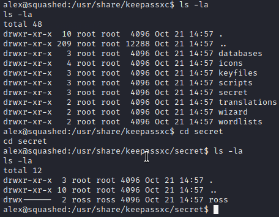

This is where access to user "ross" was useful, as alex can't see the contents of these.

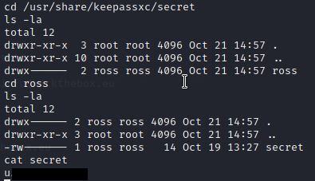

I figured this could be the master password for the `Passwords.kdbx` I had seen earlier, but I could not open it without the keyfile as well

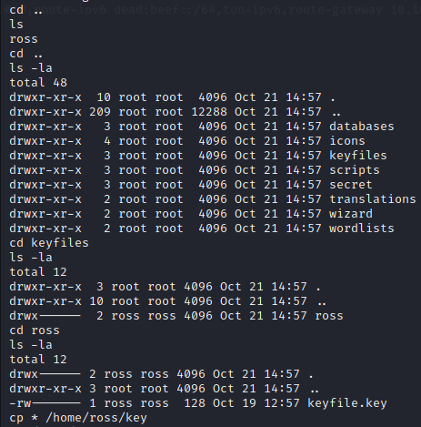

This time it worked: `keepassxc-cli extract [database] -k [keyfile]`.

NOTE: I had problems running `keepassxc-cli` having ross' EUID, so I had to change some permissions and do it as alex

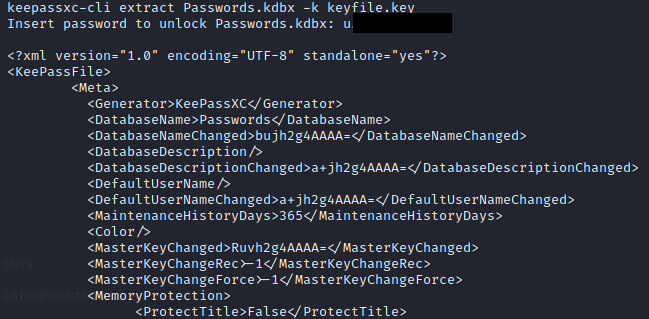

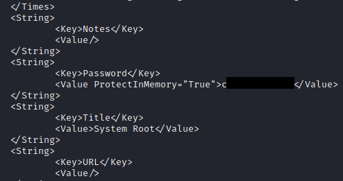

I ended up looking at the password for system root and have finished the box after I upgraded my shell. 

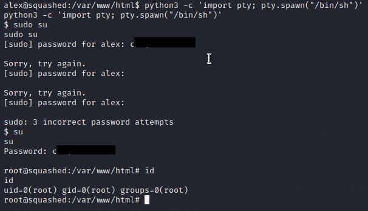